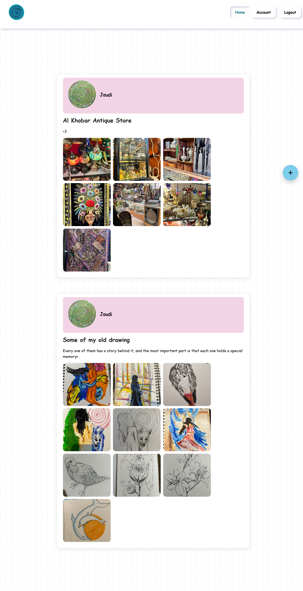
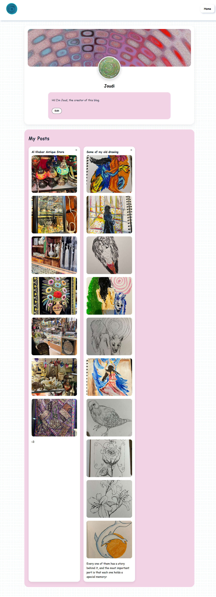

# Blog Website

A simple blog website I created to learn and improve my skills in **Node.js and server-side development**.

I wanted to build something simple and clean while practicing how the frontend connects with the server and database.

## Features

* Create and publish posts
* Add images to posts
* Edit your profile
* Add a personal bio
* Customize your profile with a preferred theme color
* View posts and user information
* Simple and clean design

## Technologies

* HTML
* CSS
* JavaScript
* Node.js
* Express.js
* PostgreSQL

## Screenshots

### Home Page

### Profile Page

